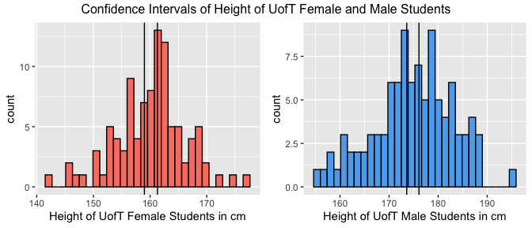

Estimating Heights of UofT Students
================
Author: Jenny Oh \
Date: September 29, 2022

# Part 1

## Goal

On Reddit r/UofT, there are many posts regarding height which show high
interest in height of the students at the University of Toronto. The
posts usually concern whether they feel they are too short to go on a
date or they feel intimidated because they think students at the
University of Toronto are generally tall (hesoum, 2021; imustgrowtaller,
2022). According to Shields et al. (2011), the average height of
Canadians is 175.1 cm for males and 162.3 cm for females. However,
considering that there are many international students at the UofT, the
Canadian height average might be a good representative of the UofT
average height. Therefore, I decided to implement a survey to find out
the average height of the University of Toronto students with the
factors of sex, ethnicity, and countries of their origin. The goal of
this survey is to find the average height of the University of Toronto
students, thus students can know whether they are objectively short or
not. Moreover, we can see how the factors of sex, ethnicity, and
countries affect the average height. For instance, we can identify
whether white UofT students are taller than Asian UofT students by
conducting a hypothesis test.

## Procedure

The survey was posted in various group chats and social media from
September 21 to 28, 2022. The target population of this survey is the
University of Toronto students, and the frame population is the people
who are in the group chats and on my social media platforms. Last, the
sample population is the UofT students who submitted the survey. However
there are a limited number of samples that could be collected from this
method due to the short period of the survey availability and a
relatively small number of students in the group chats and on social
media platforms. Moreover the group chats that I am currently in are
mostly statistics and computer science related and so are my friends on
various social media platforms. Since students in statistics and
computer science do not ideally represent the population, the data
collected can be biased. Therefore, the data for calculating the average
height is simulated using R. This can be a better alternative since we
have data of ratios of countries that UofT students are from and the
average height of various countries (University of Toronto, 2017).
Moreover, the fact that the height is normally distributed and we can
find the standard deviation of height of males and females (A’hearn et
al., 2009, Floud, 1998) makes a simulation a better alternative.

## Showcasing the Survey

<https://forms.gle/HactugP5cRtDLtJF7> (A’hearn et al., 2009)

**1. What is your biological sex at birth?**

-   Male

-   Female

-   Other / I don’t want to answer

This question is designed based on the classification of sex by the
Government of Canada (2021). It has three categories of ‘male’, ‘female’
and ‘other/ I don’t want to answer’. The question is used to identify
the responder’s sex at birth since there is a major difference between
males and females average height. Therefore most of the existing data of
average height by country shows females and males’ height respectively
(Shields et al., 2011). In addition, there could be some people who are
not comfortable identifying themselves either as a male or female. For
those people, they can choose the ‘other’ option. However, since there
is no height data for those people who do not identify themselves as
‘other’, their responses will not be used when calculating the mean
height of UofT students which could lead to a possible bias of the UofT
height data.

**2. What is your height? (in cm, please just type a numeric value)**
This question is included to find the mean height of UofT students in
cm. The sampling procedure is anonymous, so people who are not happy
with their height can feel comfortable when submitting the survey.
However there is a possibility that people who are not confident with
their height do not fill out the survey. We should be aware of the
possible bias of people who do not feel comfortable with sharing their
height. Moreover, the question indicates that the response should be in
cm since it is easier to manipulate data with the same unit. People who
are not familiar with the metric system can possibly be confused when
submitting the survey.

**3. If you answered “International Student” in the previous question,
what country are you from?**

-   China

-   India

-   United States

-   Korea (South)

-   Hong Kong

-   Taiwan

-   Iran

-   Turkey

-   Japan

-   Pakistan

-   Other:

This question is asking the country that the responder’s from. If
someone’s answering this question, it means that they indicate
themselves as an international student. (i.e., not Canadian) The options
include the categories of top 10 countries of origin of UofT
international students and the ‘other’ option, so the question can be
inclusive to as many students as possible (University of Toronto, 2017).
However, since this question is only for international students (i.e.,
students who do not hold Canadian passports) the data sorts dual citizen
students just as Canadians, yet does not count them as citizens of the
other country. This factor can be a drawback when sorting the height of
students based on their country of origin.

# Part 2

## Data

The data was simulated based one the following existing data:

1.  The countries where the UofT students are from (Canada, China,
    India, USA, Other)
2.  The ratio of ethnicity by each country
3.  The average height of males and females by each country

There are 100 samples of female students and 100 samples of male
students, respectively. The data has 4 variables which are i) country,
ii) ethnicity, iii) sex, and iv) height. Each variable is simulated
respectively and combined into one tibble.

**1. Country** : According to UofT Quick Facts, there are 15,671 Chinese
students, 2,082 Indian students, and 1,171 American students out of
27,130 international students at the University of Toronto (University
of Toronto, 2017). The number of students from each country are
converted into percentages and those percentages are applied to 100 male
and female samples. Then there are 68 Canadian students, 15 Chinese
students, 7 Indian students, 1 American student, and 9 students from
other countries for both 100 male and female samples respectively. This
data is stored with a variable ‘height’ in the simulated UofT height
data.

**2. Ethnicity** : For ethnicity, the data can be simulated based on the
percentages of ethnicity of each country. Here, we assume that the
percentages of ethnicity of each country applies to the ethnicity of
students at UofT. For Canada, roughly 73% of Canadians are European
Canadians (White), 18% are Asian Canadians (Asian), 5% are Indigenous
Canadians (Indigenous), and 3% are Black Canadians (Black) (Statistics
Canada, 2017). When those percentages are applied to 100 male and female
samples respectively, there are 50 White students, 12 Asian students, 3
Indigenous students, and 1 Black student among Canadian students for
both 100 male and female samples respectively. Applying the same method
for American students, we assume that there is one White American
student for both male and female groups since roughly 58% of Americans
are white and there is only one American student in the sample (Bureau,
2021). For Chinese and Indian students, I will assume that they are all
Asians (Thapar & K.R. Dikshit, 2019; The University of North Carolina,
2010). Thus, there are 22 Asians (15 Chinese and 7 Indian) in the sample
of 100 male and female samples respectively. This data is stored with a
variable ‘ethnicity’ in the simulated UofT height data.

**3. Sex** : The official UofT Factbook states that the ratio of male :
female is 43 : 55 (2017). It means that there are slightly more females
than males at the University of Toronto. However, the UofT Factbook data
covers the third sex identity, which is not applicable for the height
data. Therefore for convenience of simulation we set the ratio of male :
female students to 1 : 1 here. (i.e., there are 100 males and 100
females) This data is stored with a variable ‘sex’ in the simulated UofT
height data.

**4. Height** : The height data is actually simulated assuming that the
height data is normally distributed and the standard deviations of
height are 6.35 and 5.59 for male and female students respectively
(Floud, 1998). We know from existing statistics that:

1.  The average height of Canadians is 175.1cm for males and 162.3cm for
    females (Shields et al., 2011).
2.  The average height of Chinese is 172.6cm for males and 160.6cm for
    females (National Bureau of Statistics China, 2020).
3.  The average height of Indians is 165cm for males and 152cm for
    females (Mamidi et al., 2011).
4.  The average height of Americans is 175.3cm for males and 161.3cm for
    females (National Center for Health Statistics, 2021).
5.  The average height of humans around the globe is 171cm for males and
    159cm for females (Roser et al., 2013).

With the number of students varied by their countries of origin
calculated in the country section, the standard deviations for male and
female, and the existing data of average height by each country, we can
simulate height data using rnorm() function for every combination of sex
and country of origin. This data is stored with a variable ‘height’ in
the simulated UofT height data.

Combining all the variables mentioned above, it makes one tibble with
200 samples with variables of height, sex, country, and ethnicity. The
glimpse of the UofT height data can be found in **Appendix \[1\]**.

| ethnicity  |   n |   mean |    sd | minimum | maximum |
|:-----------|----:|-------:|------:|--------:|--------:|
| African    |   2 | 168.79 | 11.02 |  161.00 |  176.59 |
| Asian      |  34 | 172.07 |  8.83 |  154.97 |  186.52 |
| Indigenous |   3 | 183.59 |  4.06 |  178.98 |  186.64 |
| Latin      |   1 | 172.33 |    NA |  172.33 |  172.33 |
| Other      |   9 | 176.42 |  4.94 |  170.06 |  184.86 |
| White      |  51 | 176.28 |  7.50 |  157.68 |  194.84 |

UofT Male Height by Ethnicity

Here are the histograms and the table generated in R with the data
simulated. The gridExtra package was used to combine two plots into one
grid and the knitr package was used to produce the summary table
(Anderson, 2020; Xie et al., 2022).

The simulated UofT height data is clean and tidy since it has every
variable needed, does not contain any N/A values, and each observation
has the same unit (if numerical) without nonsensical or meaningless
values.

The histograms show the height distribution of UofT male and female
students respectively. From the histogram, we can see that both of male
and female height distributions look symmetric and unimodal (i.e.,
normally distributed). Most of the female height is centred around 160
cm while most of the male height is centred around 175 cm.

The summary table shows the number of observations, mean, standard
deviation, minimum and maximum of height of UofT male students grouped
by ethnicity. From the table, we see that the majority of UofT male
students are white and Asian. Comparing the two groups, the table shows
that the mean height of UofT Asian male students is 172.07 cm while the
average white male height is 176.28 cm. By comparing the means, we can
assume that white male UofT students are generally taller than Asian
males.

## Methods

We will conduct a hypothesis testing to compare the height of UofT Asian
and White male students and find confidence intervals of the average
height of UofT male and female students respectively.

**Hypothesis Testing** I found that people posted their concerns about
height on Reddit were mostly Asian male students (hesoum, 2021).
Therefore, we are conducting a hypothesis test in order to test whether
Asian male UofT students are genuinely shorter than White male UofT
students. We assume that the data is normal and the standard deviation
is equal *σ* = 6.35 for the population, White UofT males, and Asian UofT
males (Floud, 1998).

Let *μ**w**m* be the mean height of white male UofT students,
and *μ**a**m* be the mean height of Asian male UofT students.

*H*0 : *μ**w**m* = *μ**a**m*
*H*1 : *μ**w**m* ≠ *μ**a**m*

| ethnicity |   n |   mean | variance |
|:----------|----:|-------:|---------:|
| Asian     |  34 | 172.07 |    77.92 |
| White     |  51 | 176.28 |    56.24 |

Numerical Summary of Asian and White Males

-   Assume
    *σ**wm*2 = *σ**am*2 = *σ*2
    to test
    *H*0 : *μ**wm* = *μ**am*
    against
    *H*1 : *μ**wm* ≠ *μ**am*. The
    following statistics are calculated using the formula (Devore &
    Berk, 2012). The calculations are included in **Appendix \[3\]**.

-   Summary Statistics:
    *x̄**wm* = 176.28, *s**wm*2 = 56.24, *n**wm* = 51
    *x̄**am* = 172.07, *s**am*2 = 77.92, *n**am* = 34

-   Under *H*0 : *μ**wm* = *μ**am*:
    $$\\bar{X}\_{wm}-\\bar{X}\_{am} \\sim N(0, \\frac{\\sigma^2}{n\_{wm}}+\\frac{\\sigma^2}{ n\_{am}})$$

-   Pooled variance:
    *s**p*2 = 64.86

-   Test Statistic:
    *t* = 2.36

-   Sampling Distribution: *t* ∼ *T**df* = 83

-   P-value: This is a two-tailed test and here we find the probability
    of observing a difference in mean heights as extreme as it was
    observed. In our data,
    *x̄**wm* − *x̄**am* = 4.216514.

*P*(∣*T**df* = 83∣≥2.36) = 0.02

It is found that the p-value is 0.02.

**Confidence Interval** We found from the simulation that the average
height of UofT students was 175 cm for males and 160 cm for females.
However, since this is a simulated data, we cannot be certain that the
population mean is the same as the simulated data. Therefore, we will
derive 95% confidence intervals of the mean height of UofT students for
both males and females.

Assume that the data is normally distributed and the variance is known
for each female and male.   Confidence interval for the unknown
population mean *μ* where the population variance *σ*2 is
known:

Using the formula for calculating the confidence interval (please see
**Appendix \[2\]** for the calculation),

$$(\\bar{x}\_{n} - z\_{\\alpha/2}\\frac{\\sigma}{\\sqrt{n}}, \\bar{x}\_{n} + z\_{\\alpha/2}\\frac{\\sigma}{\\sqrt{n}})$$

it is found that the confidence interval is (173.65, 176.14) cm for male
UofT students and (159.06, 161.26) cm for female UofT students (Devore &
Berk, 2012).

-   **Male**:
    (173.65,176.14)
-   **Female**:
    (159.06,161.26)

## Results

For the hypothesis testing, it is found that the p-value is 0.02. It
means that if there is no difference in height between White and Asian
UofT male students, there is only a 2% chance that the height would
differ by 4.22 cm in the simulated samples. The p-value of 0.02 gives us
moderate evidence against the null hypothesis where there is no
difference between the mean height between the two groups. Therefore, it
gives some evidence that the mean height of White and Asian UofT male
students differ, although we cannot be certain since the p-value is not
extremely unusual. The knitr package is used to produce the summary
table (Xie et al., 2022).

| p-value | Test Statistic |
|--------:|:---------------|
|    0.02 | t = 2.36       |

Summary Table of the Hypothesis Testing

For the confidence interval, it is found that the confidence intervals
are (173.6, 176.1) cm for male UofT students and (159.0, 161.3) cm for
female UofT students. Therefore, we can conclude that we are 95%
confident that the average height is a number between 173.6 and 176.1 cm
for male UofT students and between 159.0 and 161.3 cm for female UofT
students. With the confidence intervals, UofT students can see if they
are fairly short or tall compared to the potential average depends on
their gender among all the UofT students. The gridExtra package is used
to combine two plots into one grid (Anderson, 2020).

## Bibliography

1.  A’hearn, B., Peracchi, F., & Vecchi, G. (2009). *Height and the
    Normal Distribution: Evidence from Italian Military Data.*
    Demography, 46(1), 1–25.
    <https://www.ncbi.nlm.nih.gov/pmc/articles/PMC2831262/>
2.  Anderson, R. D. P., Sean Kross, and Brooke. (2020). *4.5 The grid
    Package \| Mastering Software Development in R. In bookdown.org.*
    <https://bookdown.org/rdpeng/RProgDA/the-grid-package.html>
3.  Bureau, U. C. (2021, August 12). *Racial and Ethnic Diversity in the
    United States: 2010 Census and 2020 Census.* Census.gov.
    <https://www.census.gov/library/visualizations/interactive/racial-and-ethnic-diversity-in-the-united-states-2010-and-2020-census.html>
4.  Devore, J. L., & Berk, K. N. (2012). *Modern mathematical statistics
    with applications.* Springer, Cop.
5.  Floud, R. (1998, November 1). *Height, Weight, and Body Mass of the
    British Population Since 1820.* National Bureau of Economic
    Research. <https://www.nber.org/papers/h0108>
6.  Government of Canada, S. C. (2021, October 18). *Sex at birth of
    person.* Www23.Statcan.gc.ca.
    <https://www23.statcan.gc.ca/imdb/p3Var.pl?Function=DEC&Id=24101>
7.  Grolemund, G. (2014, July). *Introduction to R Markdown.*
    Rmarkdown.rstudio.com.
    <https://rmarkdown.rstudio.com/articles_intro.html>
8.  hesoum. (2021, October 1). *why do ppl here feel so tall?* Reddit.
    <https://www.reddit.com/r/UofT/comments/pyyyjf/why_do_ppl_here_feel_so_tall/>
9.  imustgrowtaller. (2022, September 15). *Is my dating life doomed
    (5’4 guy)?* Reddit.
    <https://www.reddit.com/r/UofT/comments/xenl42/is_my_dating_life_doomed_54_guy/>
10. Mamidi, R. S., Kulkarni, B., & Singh, A. (2011). *Secular Trends in
    Height in Different States of India in Relation to Socioeconomic
    Characteristics and Dietary Intakes.* Food and Nutrition Bulletin,
    32(1), 23–34. <https://doi.org/10.1177/156482651103200103>
11. National Bureau of Statistics China. (2020, April 8). *The Fifth
    National Physical Fitness Monitoring Statistical Survey System.*
    Www.stats.gov.cn.
    <http://www.stats.gov.cn/tjfw/bmdcxmsp/bmzd/202004/t20200408_1737530.html>
12. National Center for Health Statistics. (2021). *Vital and Health
    Statistics Analytical and Epidemiological Studies.*
    <https://www.cdc.gov/nchs/data/series/sr_03/sr03-046-508.pdf>
13. Roser, M., Appel, C., & Ritchie, H. (2013). *Human Height.* Our
    World in Data. <https://ourworldindata.org/human-height>
14. Shields, M., Gorber, S. C., Janssen, I., & Tremblay, M. S. (2011).
    *The bias in self-reported estimates of obesity in Canadian health
    surveys: An update on establishing correction equations for adults.*
    Canadian Journal of Diabetes, 35(2), 200.
    <https://doi.org/10.1016/s1499-2671(11)52226-9>
15. Statistics Canada. (2017, October 25). *Ethnic and cultural origins
    of Canadians: Portrait of a rich heritage.* Statcan.gc.ca;
    Government of Canada, Statistics Canada.
    <https://www12.statcan.gc.ca/census-recensement/2016/as-sa/98-200-x/2016016/98-200-x2016016-eng.cfm>
16. Thapar, R., & K.R. Dikshit. (2019). *India - People.* In
    Encyclopædia Britannica.
    <https://www.britannica.com/place/India/People>
17. The University of North Carolina. (2010). *LibGuides: Chinese Ethnic
    Groups: Overview Statistics.* Unc.edu.
    <https://guides.lib.unc.edu/china_ethnic/statistics>
18. University of Toronto. (2017). *Quick Facts \| University of
    Toronto.* Utoronto.ca.
    <https://www.utoronto.ca/about-u-of-t/quick-facts>
19. Xie, Y., Dervieux, C., & Riederer, E. (2022). *10.1 The function
    knitr::kable() \| R Markdown Cookbook. In bookdown.org.* CRC Press.
    <https://bookdown.org/yihui/rmarkdown-cookbook/kable.html>

## Appendix

### \[1\]

Here is a glimpse of the data set simulated:

    ## Rows: 200
    ## Columns: 4
    ## $ height    <dbl> 162.6645, 182.9874, 176.6701, 188.6707, 169.0427, 174.9084, …
    ## $ sex       <chr> "Male", "Male", "Male", "Male", "Male", "Male", "Male", "Mal…
    ## $ country   <chr> "Canada", "Canada", "Canada", "Canada", "Canada", "Canada", …
    ## $ ethnicity <chr> "White", "White", "White", "White", "White", "White", "White…

### \[2\]

-   Sampling Distribution:
    *t* ∼ *T**df* = *n**wm* − *n**am* − 2,
    which is *t* ∼ *T**df* = 83

-   P-value: This is a two-tailed test, find the probability of
    observing a difference in mean scores as extreme as was observed. In
    our data, *x̄**wm* − *x̄**am* = 4.216514.

*P*(∣*T**df* = 83∣≥2.364765617) = 0.01018758 ⋅ 2 = 0.02037515

### \[3\]

Confidence interval:
$(174.8928 -1.96 \\cdot \\frac{6.35}{\\sqrt{100}}, 174.8928 +1.96 \\cdot \\frac{6.35}{\\sqrt{100}})$
